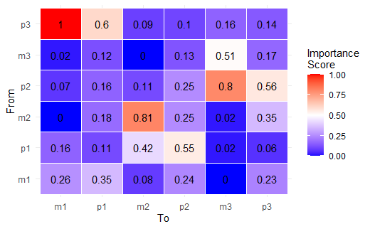
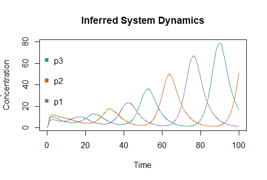
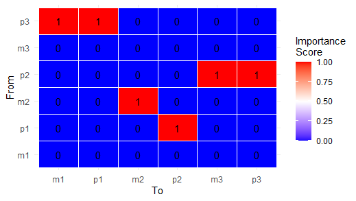
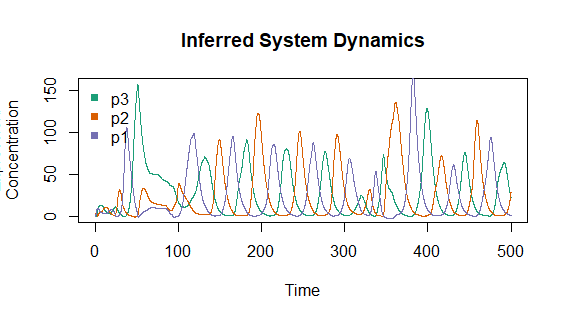
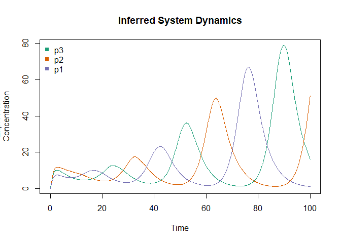
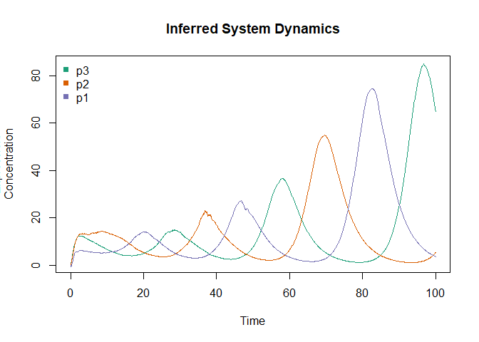

<!-- README.md is generated from README.Rmd. Please edit that file -->

# dynUGENE

<!-- badges: start -->

<!-- badges: end -->

dynUGENE is an R package for the inference, simulation, and
visualization of gene regulatory network dynamics from time-series
expression data.

## Description

dynUGENE build off dynGENIE3, an algorithm to infer gene network
architecture and dynamics given time-series or steady-state expression
data.

dynUGENE provides several additional functionalities on top of
dynGENIE3.

  - Visualization of the inferred network as a heatmap.
  - Simulation of the learned system given any initial condition.
  - Stochastic simulations by accounting for uncertainty in the random
    forests’ predictions
  - Model selection using a Pareto front by comparing model error with
    model complexity.
  - Additional datasets (repressilator, Hodgkin-Huxley) both
    deterministic and stochastic.

## Installation

<!-- You can install the released version of dynUGENE from [CRAN](https://CRAN.R-project.org) with: -->

<!-- ``` r -->

<!-- install.packages("dynUGENE") -->

<!-- ``` -->

Install the development version with:

``` r
install.packages("devtools")
devtools::install_github("tianyu-lu/dynUGENE", build_vignettes = TRUE)
library("dynUGENE")
```

## Overview

``` r
library("dynUGENE")
ls(package:dynUGENE)
#> Warning in ls(package:dynUGENE): 'package:dynUGENE' converted to character
#> string
#> [1] "HodgkinHuxley"           "inferNetwork"           
#> [3] "inferSSNetwork"          "plotTrajectory"         
#> [5] "Repressilator"           "simulateUGENE"          
#> [7] "StochasticHodgkinHuxley" "StochasticRepressilator"
#> [9] "tuneThreshold"
data(package="dynUGENE")
```

We can learn the architecture and simulate the dynamics of a
repressilator with `inferNetwork()`:

 

We can perform a search over possible sparse network architectures with
`tuneThreshold()`.




We can also learn the dynamics of a stochastic repressilator:



We can also visualize the learned networks for large, steady-state
datasets:


For detailed tutorials and descriptions of the provided datasets, see
the vignette here:

``` r
browseVignettes("dynUGENE")
#> No vignettes found by browseVignettes("dynUGENE")
```

## Contributions

With the exception of `estimateDecayRates.R`, the remaining files are
original code. `inferNetwork.R` is a re-implementation of the dynGENIE3
algorithm in R. The original implementation wraps around a random forest
implementation written in C. dynuGENE implements everything in R.
Sources for snippets of code when taken from examples are provided near
the code in question.

## References

  - [Elowitz, M. B., & Leibler, S. (2000). A synthetic oscillatory
    network of transcriptional regulators.
    Nature, 403(6767), 335-338.](https://www.nature.com/articles/35002125)

  - [Geurts, P. (2018). dynGENIE3: dynamical GENIE3 for the inference of
    gene networks from time series expression data. Scientific
    reports, 8(1), 1-12.](https://www.nature.com/articles/s41598-018-21715-0)

  - [Pau Bellot, Catharina Olsen and Patrick E Meyer (2020). grndata:
    Synthetic Expression Data for Gene Regulatory Network Inference. R
    package version
    1.20.0.](https://bioconductor.org/packages/release/data/experiment/vignettes/grndata/inst/doc/grndata.html)

  - [Hodgkin, A. L., & Huxley, A. F. (1952). A quantitative description
    of membrane current and its application to conduction and excitation
    in nerve. The Journal of
    physiology, 117(4), 500.](https://www.ncbi.nlm.nih.gov/pmc/articles/PMC1392413/)

  - [Mangan, N. M., Brunton, S. L., Proctor, J. L., & Kutz, J. N.
    (2016). Inferring biological networks by sparse identification of
    nonlinear dynamics. IEEE Transactions on Molecular, Biological and
    Multi-Scale
    Communications, 2(1), 52-63.](https://ieeexplore.ieee.org/abstract/document/7809160)

## Acknowledgements

This package was developed as part of an assessment for 2020 BCB410H:
Applied Bioinformatics, University of Toronto, Toronto, CANADA.

## Example

Load and do inference with repressilator data:

``` r
library(dynUGENE)

## Infer network
ugene <- inferNetwork(Repressilator, mtry=3L)
#> Training node 1
#> Training node 2
#> Training node 3
#> Training node 4
#> Training node 5
#> Training node 6

## Deterministic simulation of the inferred network dynamics
x0 <- Repressilator[1, 2:7]
trajectory <- simulateUGENE(ugene, x0)
plotTrajectory(trajectory, c("p3", "p2", "p1"))
```



``` r

## Stochastic simulation
trajectory <- simulateUGENE(ugene, x0, stochastic=TRUE)
plotTrajectory(trajectory, c("p3", "p2", "p1"))
```


