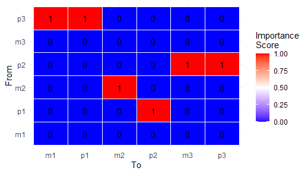
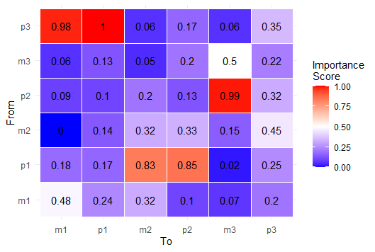

```{r, include = FALSE}
knitr::opts_chunk$set(
  collapse = TRUE,
  comment = "#>"
)
```

## Introduction

dynUGENE (dynamical Uncertainty-aware GEne Network Inference with Ensembles of trees) is an extension of dynGENIE3. Given time series or steady state data a set of species (mRNA/protein/ion concentrations), dynUGENE provides tools for the visualization, analysis, and simulation of the results of the dynGENIE3 method. 

## Details
### dynGENIE3 Algorithm

Suppose you have access to a time series dataset of the expression levels of $p$ genes in a gene regulatory network. The expression levels of each gene is measured at $N$ time points. Thus, the dataset can be organized as $$\mathcal{D} = \{\mathbf{x}(t_1), \cdots, \mathbf{x}(t_N)\}$$ where each $\mathbf{x}(t_k) \in \mathbb{R}, k=1, \cdots, N$ is a column vector storing the expression levels of all $p$ genes at some time step $t_k$. dynGENIE3 fits a random forest $f_j$ for each gene $x_j$ according to the following model of gene expression: $$\frac{dx_j(t)}{dt} = -\alpha_j x_j(t) + f_j(\mathbf{x}(t)),\; \forall\; j$$ where $\alpha_j$ is the degradation rate of gene $x_j$. This parameter can be preset by the user, or can be fitted from the data given the maximum and minumum of the expression levels and assuming exponential decay between these two points. In practice, the dataset is made of discrete time steps. To accomodate this, the learning sample for training the random forest for gene $x_j$ becomes instead $$\Bigg\{ \mathbf{x}(t_k), \; \frac{x_j(t_{k+1}) - x_j(t_k)}{t_{k+1} - t_k} + \alpha_j x_j (t_k) \Bigg\}_{k=1,\;\cdots,\;N-1}$$ Intuitively, we ask the random forest to predict the change in concentration of some gene $x_j$ and its degradation, given the current concentrations of all gene levels. Ranking the connectivity of the gene regulatory network is posed as $p$ different feature selection problems, where the importance of a directed edge from gene $x_j$ to $x_i$ is determined by the importance of gene $x_j$ as a feature for the random forest $f_j$. dynGENIE3 uses the Mean Decrease Impurity measure, which is a measure of how much the subtrees have a reduced variance due to a split by feature $x_j$: $$I(n) = |S|\cdot\text{Var}(S) - |S_T|\cdot\text{Var}(S_T) - |S_F|\cdot\text{Var}(S_F)$$ where $S$ is the set of samples that reach node $n$, $S_T$ is the subset of elements that are true according to the split, and $S_F$ is the subset of elements that are false. If a feature is used as a split at multiple nodes, its importance is the average of all individual importance scores.

### dynGENIE3 for Steady-State Data

At steady state, $\frac{dx_j(t)}{dt} = 0 \;\; \forall j$. Thus, the learning sample becomes $$\Big\{ \mathbf{x}(t_k), \; \alpha_j x_j (t_k) \Big\}_{k=1,\;\cdots,\;N-1}$$. All other parts of the dynGENIE3 algorithm remains the same. 

### Extensions to dynGENIE3

dynUGENE provides several additional functionalities on top of dynGENIE3.
    * Visualization of the inferred network as a heatmap.
    * Simulation of the learned system given any initial condition.
    * Stochastic simulations by accounting for uncertainty in the random forests' predictions
    * Model selection using a Pareto front by comparing model error with model complexity.
    * Additional datasets (repressilator, Hodgkin-Huxley) both deterministic and stochastic.

## Loading Data
Four datasets are provided, the repressilator and Hodgkin-Huxley and their stochastic counterparts. See more info with `?Repressilator` and `?HodgkinHuxley` for the deterministic data, and `?StochasticRepressilator` and `?StochasticHodgkinHuxley` for their stochastic counterparts. Note that the noise added to create the stochastic counterparts are not simply Gaussian noise, but rather the solutions to stochastic differential equations with diagonal noise.

### Repressilator
The repressilator is a synthetic gene circuit designed by Elowitz & Leibler (2000). A negative-feedback loop along with similar mRNA and protein degradation rates together makes the system exhibit oscillatory behaviour. The dynamics of the proteins, under the deterministic ODEs below, show a constant period and amplitude after some time.

\begin{equation*}
\frac{d}{dt}m_1(t) = \alpha_0 + \frac{\alpha}{1 + p_3(t)^n} - m_1(t)  \; \; \; \; \; \; \; \; \; \; \; \; \frac{d}{dt}p_1(t) = \beta m_1(t) - \beta p_1(t)
\end{equation*}
\begin{equation*}
\frac{d}{dt}m_2(t) = \alpha_0 + \frac{\alpha}{1 + p_1(t)^n} - m_2(t)  \; \; \; \; \; \; \; \; \; \; \; \; \frac{d}{dt}p_2(t) = \beta m_2(t) - \beta p_2(t)
\end{equation*}
\begin{equation*}
\frac{d}{dt}m_3(t) = \alpha_0 + \frac{\alpha}{1 + p_2(t)^n} - m_3(t)  \; \; \; \; \; \; \; \; \; \; \; \; \frac{d}{dt}p_3(t) = \beta m_3(t) - \beta p_3(t)
\end{equation*}

where the $m_i$ are the mRNA concentrations and $p_i$ are the protein concentrations. $\alpha_0$ is the basal transcription rate of mRNA, $\beta$ is the decay rate of all three mRNA species and all three protein species, and $n = 2$ is the Hill coefficient.

<div style="text-align:center"><div style="text-align:left">

In practice, the data is collected by measuring the level of fluorescence of GFP, whose expression dynamics is a proxy of the dynamics of protein $p_3$. However, in experiments (Potvin-Trottier et al.) the period and amplitude are not constant. To model this scenario we include stochastic repressilator data shown below.

<div style="text-align:center"><div style="text-align:left">

We include five different stochastic trajectories from the same initial conditions in `StochasticRepressilator`. 

### Hodgkin-Huxley

Hodgkin and Huxley (1952) published a mathematical model of the action potential. The system of ODEs is the following:
\begin{equation*}
\frac{d}{dt}V(t) = \frac{1}{C}\Big(g_{\text{Na}}(t)(E_{\text{Na}} - V(t)) + g_{\text{K}}(E_{\text{K}} - V(t)) + g_{\text{leak}}(E_{\text{leak}} - V(t)) + I_{\text{applied}} \Big)
\end{equation*}
\begin{equation*}
\frac{d}{dt}n(t) = \alpha_n(t)(1-n(t)) - \beta_n(t)n(t)
\end{equation*}
\begin{equation*}
\frac{d}{dt}m(t) = \alpha_m(t)(1-m(t)) - \beta_m(t)m(t)
\end{equation*}
\begin{equation*}
 \frac{d}{dt}h(t) = \alpha_h(t)(1-h(t)) - \beta_h(t)h(t)
\end{equation*}
\begin{equation*}
\alpha_n(t) = 0.1\frac{10-V(t)}{e^{(10-V(t))/10}-1}
\end{equation*}
\begin{equation*}
\beta_n(t) = 0.125e^{-V(t)/80}
\end{equation*}
\begin{equation*}
\alpha_m(t) = 0.1\frac{25-V(t)}{e^{(25-V(t))/10}-1}
\end{equation*}
\begin{equation*}
\beta_m(t) = 4e^{-V(t)/18} 
\end{equation*}
\begin{equation*}
\alpha_h(t) = 0.07e^{-V(t)/20}
\end{equation*}
\begin{equation*}
\beta_h(t) = \frac{1}{e^{(30-V(t))/10} + 1}
\end{equation*}

$g_{\text{K}}(t) = \bar{g}_{\text{K}}(n(t))^4$ is the potassium conductance and $g_{\text{Na}}(t) = \bar{g}_{\text{Na}}(m(t))^3h(t)$ is the sodium conductance, where $\bar{g}_{\text{K}}$ and $\bar{g}_{\text{Na}}$ are the maximal conductances for potassium and sodium respectively.

We also provide Hodgkin-Huxley data with noise.

### Loading your own data

See the provided data for an example format. The first column should be named
't' with the timestamps. The remaining columns should have unique names. NA
values need to be preprocessed before loading. Multiple experiments can be
loaded in the same file, see `?inferNetwork` for details.

## Case Study 1: Deterministic Repressilator
### Learning
The `inferNetwork()` function can be used to learn and visualize the underlying network. By default, all connections between all nodes are possible.
``` r
ugene <- inferNetwork(Repressilator, mtry=3L, showPlot=TRUE)
```
<div style="text-align:center"><div style="text-align:left">

The heatmap shows the directed edges of the learned network. The numbers on each grid is the normalized importance score as determined by the random forests. The scores are shown by default. For networks with nodes $>> 6$, it's advised to set `showScores=FALSE`. 

### Simulation
dynUGENE allows for the simulation of learned network with `simulateUGENE()`. Here `x0` is a data.frame of the initial concentrations of each node in the system. This can be changed according to your desired initial conditions.

```r
x0 <- Repressilator[1, 2:7]
trajectory <- simulateUGENE(ugene, x0)
plotTrajectory(trajectory, c("p3", "p2", "p1"))
```

<div style="text-align:center"><div style="text-align:left">

Here we can see that the dynamics of the simulation resembles the data fairly well. For a quantitative measure of the accuracy of the simulation compared to the data, the mean squared errors of all the trees can be obtained by `ugene$model[[i]]$mse`, for the trees used to predict the `i`th gene.

### Pruning
However, as is the case with many biological systems, a dense, fully-connected network is not realistic. As seen in the repressilator equations, $m_1$ is only influenced by $p_3$ and $m_1$. Promisingly, the heatmap indeed shows that $p_3$ and $m_1$ are the main contributers to $m_1$, but there are also nonzero contributions from the other components. 

To sparsify the learned network, dynUGENE provides two methods of masking out connections, described in detail in `?tuneThreshold`. The simplest network is one where there is a nonzero value in each column, an example is shown below.

<div style="text-align:center"><div style="text-align:left">

This requirement is necessary because at least one value is needed in 'From' for predicting each value in 'To'. 

```r
result <- tuneThreshold(Repressilator, ugene)
ugene3 <- inferNetwork(Repressilator, mask=result$step.masks[[3]], showPlot=TRUE)
ugene7 <- inferNetwork(Repressilator, mask=result$step.masks[[7]], showPlot=TRUE)
```

<div style="text-align:center"><div style="text-align:left">

We can see a sharp drop in the error as model complexity (i.e. the number of connections) increases for both methods of masking. This is known as the Pareto front and helps in discovering the most parsimonious model (Mangan \emph{et al}. 2016). The third and seventh masks in the step-wise plot seem to show drops in error. The learned sparse networks are shown below.

<div style="text-align:center"><div style="text-align:left">

<div style="text-align:center"><div style="text-align:left">

It's clear that some learned connections, such as from $p_1$ to $p_2$, are not present in the initial set of ODEs. However, we know that they are correlated indirectly by means of $m_2$. As well, we can simulate the dynamics of this sparse network. Let's compare the simulated trajectories of mask 3 and mask 7.

```r
ugene3 <- inferNetwork(Repressilator, mask=result$step.masks[[3]])
trajectory <- simulateUGENE(ugene3, x0, mask=result$step.masks[[3]])
plotTrajectory(trajectory, c("p3", "p2", "p1"))
ugene7 <- inferNetwork(Repressilator, mask=result$step.masks[[7]])
trajectory <- simulateUGENE(ugene7, x0, mask=result$step.masks[[7]])
plotTrajectory(trajectory, c("p3", "p2", "p1"))
```

Mask 3:

<div style="text-align:center"><div style="text-align:left">

Mask 7:

<div style="text-align:center"><div style="text-align:left">

It's clear that the small error in the predicting the change of a species does not imply a small error in the simulated trajectory. But mask 16 does show some good oscillatory behaviour.

<div style="text-align:center"><div style="text-align:left">

### Uncertainty-aware Simulations
There is also the option to account for uncertainty in the random forests' outputs by setting `stochastic=TRUE` in the `simulateUGENE()` function. 

```r
ugene <- inferNetwork(Repressilator, mtry=3L)
x0 <- Repressilator[1, 2:7]
trajectory <- simulateUGENE(ugene, x0, stochastic=TRUE)
plotTrajectory(trajectory, c("p3", "p2", "p1"))
```

Uncertainty is incorporated by taking the mean and variance of the set of predictions made by all the trees in each random forest. The prediction is then sampled from a Gaussian $\mathcal{N}(\mu_i, \sigma_i^2)$ where $\mu_i$ is the mean and $\sigma_i^2$ is the variance of the predictions for node $i$.

<div style="text-align:center"><div style="text-align:left">

Here, the model predictions are fairly confident and thus the stochastic behaviour is not pronounced in the simulation. 

### Hyperparameters
The learned network is sensitive to the hyperparameters given to the random forest. For example, the `mtry` parameter is the number of variables a random forest uses to make a split. The learned networks under `mtry=1L` or `mtry=2L` are shown below.

<div style="text-align:center"><div style="text-align:left">
<div style="text-align:center"><div style="text-align:left">

As shown, the learned networks are qualitatively different. For `mtry=1L`, the influence of $m_2$ on $p_2$ is high, while for `mtry=2L` the highest influence goes to $p_1$. 

## Case Study 2: Stochastic Repressilator

The provided dataset for a stochastic repressilator gives an example of how to include data from more than one experiment. Here, we train a dynUGENE model on five different simulations of a stochastic repressilator. The training and simulation will take a few minutes due to a large dataset and a longer simulation time.

```r
ugene <- inferNetwork(StochasticRepressilator, multiple.exp=TRUE)
trajectory <- simulateUGENE(ugene, x0, tend=500)
plotTrajectory(trajectory, c("p3", "p2", "p1"))
```
<div style="text-align:center"><div style="text-align:left">

The flexibility of parameterizing functions using random forests is reflected in the model's ability to learn not only oscillatory behaviour, but also that oscillations occur with different amplitudes and occasionally out of phase, matching the qualitative behaviour of the input data.

## Case Study 3: Steady-State Data

We will fit a dynUGENE model for steady state gene expression data using `inferSSNetwork()`. The data comes from the Bioconductor package [`grndata`](https://bioconductor.org/packages/release/data/experiment/vignettes/grndata/inst/doc/grndata.html).  

```r
data <- grndata::syntren300.data
ugene <- inferSSNetwork(data, showPlot=TRUE)
```
<div style="text-align:center"><div style="text-align:left">

The number of nodes for this network is 300. As `grndata` has other datasets upwards to thousands of nodes, visualization for the learned steady-state network includes clustering with the dendrograms not shown. There appears to be some clusters in the lower-left of the matrix, let's take a closer look.

```r
gplots::heatmap.2(ugene$network[270:300, 0:30],
                   trace="none", col=myCols,
                   ylab = "From", xlab = "To", labRow = FALSE, 
                   labCol = FALSE, margins = c(2, 2))
```
<div style="text-align:center"><div style="text-align:left">

The rows with high sums of importance scores can be interpreted as master regulators. For example the gene for the last row is `ebgR`, which is a [transcriptional regulator](https://www.uniprot.org/uniprot/A0A086V7N0). Rows that cluster together can be interpreted as regulators with similar function. 

```r
rownames(ugene$network)[295:300]
```

```{r setup}
library(dynUGENE)
```

<div style="text-align:left">
## References

* [Elowitz, M. B., & Leibler, S. (2000). A synthetic oscillatory network of transcriptional regulators. Nature, 403(6767), 335-338.](https://www.nature.com/articles/35002125)

* [Geurts, P. (2018). dynGENIE3: dynamical GENIE3 for the inference of gene networks from time series expression data. Scientific reports, 8(1), 1-12.](https://www.nature.com/articles/s41598-018-21715-0)

* [Pau Bellot, Catharina Olsen and Patrick E Meyer (2020). grndata:
  Synthetic Expression Data for Gene Regulatory Network Inference. R
  package version 1.20.0.](https://bioconductor.org/packages/release/data/experiment/vignettes/grndata/inst/doc/grndata.html)

* [Hodgkin, A. L., & Huxley, A. F. (1952). A quantitative description of membrane current and its application to conduction and excitation in nerve. The Journal of physiology, 117(4), 500.](https://www.ncbi.nlm.nih.gov/pmc/articles/PMC1392413/)

* [Mangan, N. M., Brunton, S. L., Proctor, J. L., & Kutz, J. N. (2016). Inferring biological networks by sparse identification of nonlinear dynamics. IEEE Transactions on Molecular, Biological and Multi-Scale Communications, 2(1), 52-63.](https://ieeexplore.ieee.org/abstract/document/7809160)

----

```{r}
sessionInfo()
```
